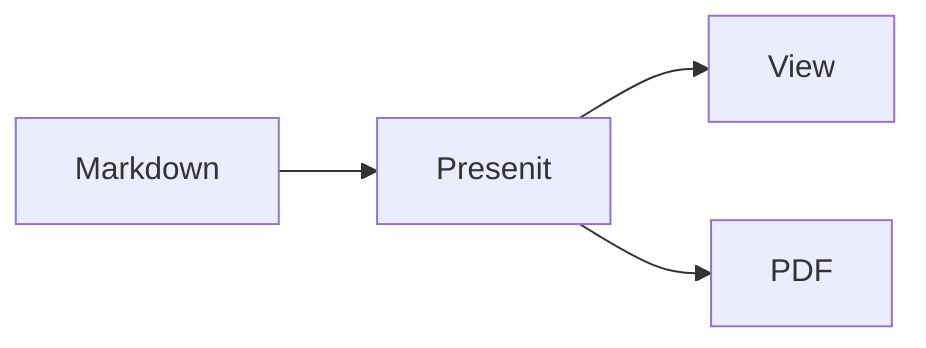

<!-- presen-it! slide-break (center-x=true) -->

# Presen'it!

Markdown から、美しいスライドを。

2026-07-30 ― AyaExpTech (@AyaExpTech)

<!-- presen-it! slide-break -->

## なにができる？

- ほぼ普通の Markdown を書くだけ
- 少ないディレクティブでページとカラムを分割
- 投影ビュー + プレゼンターモード + PDF

<!-- this is a speaker note: keep it short and useful -->

<!-- presen-it! slide-break (center-x=true) -->

## シンプルさが売り

余計な JSX も、毎回書く CSS もいらない

<!-- presen-it! slide-break -->

## ディレクティブ

```ts
const tip = "slide-break でページ分割";
```

<!-- press P for presenter mode -->

<!-- presen-it! column-break -->

- `slide-break` でページ分割
- `column-break` でカラム分割
- `center-x` / `center-y` で揃え

<!-- press P for presenter mode -->

<!-- presen-it! slide-break -->

## Mermaid & Math



<!-- presen-it! column-break -->

数式も書けます: $E = mc^2$

$$
\int_0^1 x^2 \, dx = \frac{1}{3}
$$

<!-- presen-it! slide-break (center-x=true) -->

## さあ、作ろう

`pnpm presenit dev demo`
