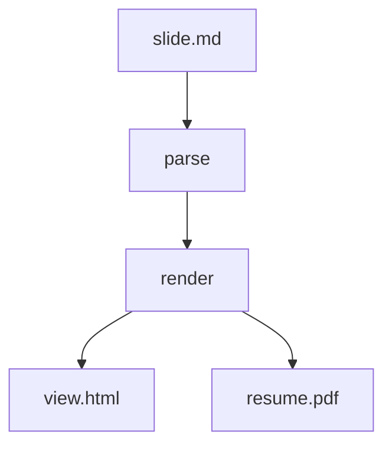

<!-- presen-it! slide-break (center-x=true) -->

# Kitchen Sink

Presen'it! の主要機能を一枚ずつ確認するサンプル

<!-- presen-it! slide-break -->

## Markdown basics

- 箇条書き
- **強調** と `inline code`
- [リンク](https://example.com)

1. 順序付き
2. リストも OK

<!-- keep notes short -->

<!-- presen-it! slide-break -->

## Code

```ts
export function greet(name: string): string {
    return `Hello, ${name}!`;
}
```

<!-- presen-it! column-break -->

```css
.hero {
    letter-spacing: 0.03em;
}
```

<!-- presen-it! slide-break -->

## Math

インライン: $a^2 + b^2 = c^2$

$$
\sum_{n=1}^{N} n = \frac{N(N+1)}{2}
$$

<!-- presen-it! slide-break (center-x=true) -->

## Mermaid



<!-- presen-it! slide-break -->

## Columns

左カラムは説明。

<!-- presen-it! column-break (center-x=true) -->

右カラムは中央揃え。

> Tip: `center-x` / `center-y` は column 側が優先されます

<!-- presen-it! slide-break (center-x=true) -->

## Done

`pnpm presenit dev kitchen-sink`
