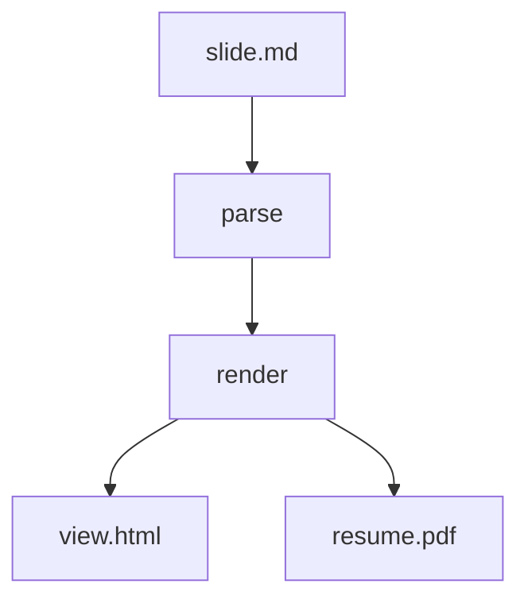

<!-- presen-it! slide-break (center-x=true) -->

# Kitchen Sink

機能・レイアウト・デザインを一通り確認するサンプル

左下にマウスを置くとナビが出ます（Overview / Presenter / Fullscreen）

<!-- tip: also try ?presenter and the O / P keys -->

<!-- presen-it! slide-break (center-x=true&center-y=true) -->

## Section divider

大きな見出しだけの区切りページ

<!-- section break example -->

<!-- presen-it! slide-break -->

## クリックで順に表示（reveal）

`<!-- presen-it! reveal (at=N) -->` で、同一スライド内をステップ表示できます。`→` / Space で進めてみてください。

この文章は最初から表示されている

<!-- presen-it! reveal (at=1) -->

この文章は一回クリックすると表示される

<!-- presen-it! column-break -->

この文章も一回クリック時点で表示される (reveal宣言はcolumnをまたぐ)

<!-- presen-it! reveal (at=2) -->

- 2回目のクリックで表示される<!-- presen-it! reveal (at=3) -->
- 3回目のクリックで表示される<!-- presen-it! reveal (at=4) -->
- 4回目のクリックで表示される<!-- presen-it! reveal (at=3) -->
- 3回目のクリックで表示される

<!-- presen-it! reveal -->

この文章は最初から表示されている (atの指定がない場合は0とみなす)

<!-- presen-it! reveal (at=5) -->

この部分は5回目のクリックで表示され、<!-- presen-it! reveal (at=6) --> この部分は6回目のクリックで表示される。

<!-- presen-it! reveal (at=7) -->

7<!-- presen-it! reveal (at=8) -->, 8<!-- presen-it! reveal (at=9) -->, 9<!-- presen-it! reveal (at=10) -->, 10!

<!-- presen-it! slide-break -->

## Markdown basics

- 箇条書き
- **強調** と _斜体_ と `inline code`
- [リンク](https://example.com)

1. 順序付き
2. リストも OK

- [ ] 未着手のタスク
- [x] 完了したタスク（読み取り専用）

<!-- keep notes short -->

<!-- presen-it! slide-break -->

## Typography ladder

# Heading 1

## Heading 2

### Heading 3

本文は読みやすさ優先。長い一文でも行間を確保して、スライドとしての密度を保ちます。

<!-- presen-it! slide-break -->

## Code

```ts
export function greet(name: string): string {
    return `Hello, ${name}!`;
}
```

<!-- presen-it! column-break -->

```css
.hero {
    letter-spacing: 0.01em;
}
```

<!-- code + columns -->

<!-- presen-it! slide-break -->

## Math

インライン: $a^2 + b^2 = c^2$

$$
\sum_{n=1}^{N} n = \frac{N(N+1)}{2}
$$

<!-- katex -->

<!-- presen-it! slide-break (center-x=true) -->

## Mermaid



<!-- diagram -->

<!-- presen-it! slide-break -->

## Two columns

左カラムは説明文。長めの段落でもカラム内で折り返します。

- ポイント A
- ポイント B

<!-- presen-it! column-break (center-x=true) -->

右カラムは中央揃え。

> Tip: `center-x` / `center-y` は column 側が優先されます

<!-- columns -->

<!-- presen-it! slide-break -->

## Quote & table

> スライドは「読む文書」から切り出す。宣言は最小限に。

| Feature  | Tool              |
| -------- | ----------------- |
| Code     | Shiki             |
| Math     | KaTeX             |
| Diagrams | beautiful-mermaid |

<!-- mixed blocks -->

<!-- presen-it! slide-break -->

## Alerts

> [!NOTE]
> Useful information that users should know, even when skimming content.

> [!TIP]
> Helpful advice for doing things better or more easily.

> [!IMPORTANT]
> Key information users need to know to achieve their goal.

> [!WARNING]
> Urgent info that needs immediate user attention to avoid problems.

> [!CAUTION]
> Advises about risks or negative outcomes of certain actions.

<!-- github alerts -->

<!-- presen-it! slide-break (center-x=true&center-y=false) -->

## Top-centered title

`center-y=false` なので縦は上寄せ、横だけ中央

<!-- alignment -->

<!-- presen-it! slide-break (center-x=true) -->

## Done

```bash
pnpm presenit dev kitchen-sink
pnpm presenit export kitchen-sink
```

投影ビューは **左右スライド端（パディング幅）** の短押しで前後移動（ドラッグ選択はページ送りしない）
