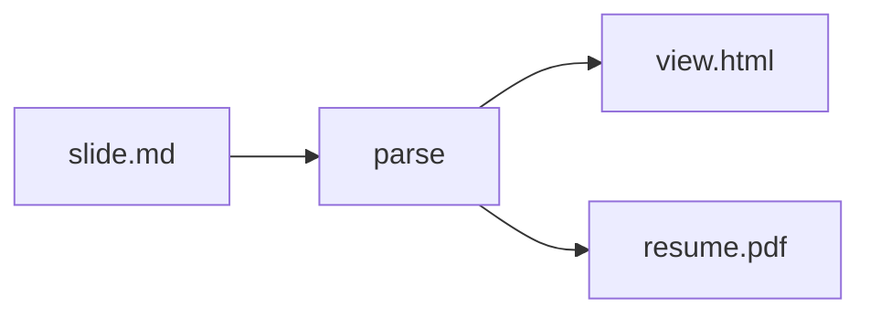

<!-- presen-it! slide-break (center-x=true) -->

# はじめに

Presen'it! のスタート用スライドです。

このファイルを編集しながら、書き方と投影の操作を確認できます。

<!-- presen-it! slide-break -->

## スライドの場所

```text
src/<slug>/slide.md
src/<slug>/assets/...
```

このデッキは `src/<slug>/slide.md` にあります。画像などは同じフォルダの `assets/` に置けます。

<!-- スピーカーノート: HTML コメントは投影に出ず、プレゼンターでだけ見えます -->

<!-- presen-it! slide-break -->

## ページ区切り（slide-break）

`<!-- presen-it! slide-break -->` で新しいスライドに進みます。

- ファイル先頭の leading `slide-break` は 1 枚目のレイアウト指定に使えます（空ページは作りません）
- 区切り直後の先頭 `##` はページヘッダーになります

<!-- presen-it! slide-break (center-x=true&center-y=true) -->

## 中央揃え

`center-x` / `center-y` で横・縦の配置を変えられます。

```html
<!-- presen-it! slide-break (center-x=true&center-y=false) -->
```

<!-- presen-it! slide-break -->

## カラム分割

左カラムに説明、右に箇条書きの例です。

<!-- presen-it! column-break -->

- `column-break` で 2 カラムに分割
- カラム側の `center-x` / `center-y` が優先されます

<!-- presen-it! slide-break -->

## Markdown の基本

- **強調**、_斜体_、`inline code`
- [リンク](https://github.com/AXT-AyaKoto/presen-it)
- 箇条書きと順序付きリスト

1. まず `slide.md` を書く
2. `presenit dev` で確認
3. `build` / `export` で配布

- [ ] 未完了タスク（読み取り専用チェックボックス）
- [x] 完了タスク

<!-- presen-it! slide-break -->

## コード

```ts
export function greet(name: string): string {
    return `Hello, ${name}!`;
}
```

フェンスコードは Shiki でハイライトされます。

<!-- presen-it! slide-break -->

## 数式と Mermaid

インライン数式: $E = mc^2$

$$
\int_0^1 x^2 \, dx = \frac{1}{3}
$$



<!-- presen-it! slide-break -->

## アラート（GitHub alerts）

> [!NOTE]
> 補足情報。スキimming しても伝えたいこと。

> [!TIP]
> もっと楽に書くためのヒント。

> [!WARNING]
> 進む前に確認してほしい注意。

<!-- presen-it! slide-break -->

## 投影ビューの操作

| キー                    | 動作                       |
| ----------------------- | -------------------------- |
| `←` `→` / Space / Enter | 前後のスライド             |
| `O`                     | オーバービュー（グリッド） |
| `P`                     | プレゼンターを別タブで開く |
| `F`                     | フルスクリーン             |

左右スライド端（パディング幅）の短押しでも前後に移動できます。左下にマウスを置くとツールバーが出ます。

<!-- presen-it! slide-break (center-x=true) -->

## 次のステップ

```bash
pnpm exec presenit dev <slug>
pnpm exec presenit build <slug>   # → dist/<slug>/view.html
pnpm exec presenit export <slug>  # → dist/<slug>/resume.pdf
```

`<slug>` をこのデッキの名前に置き換えて実行してください。内容を編集して、あなたのプレゼンを作りましょう。
